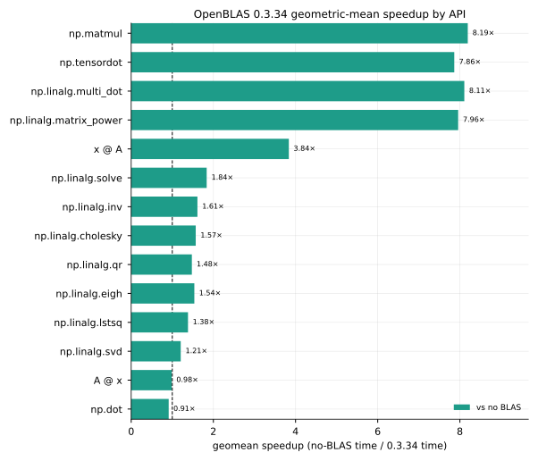
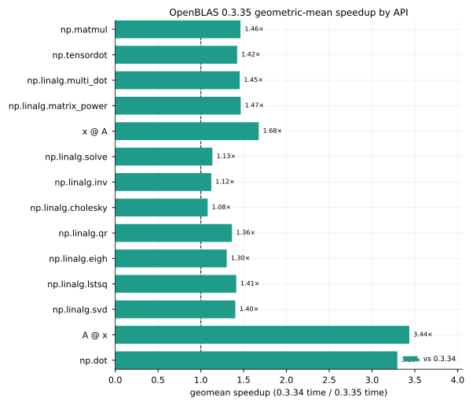
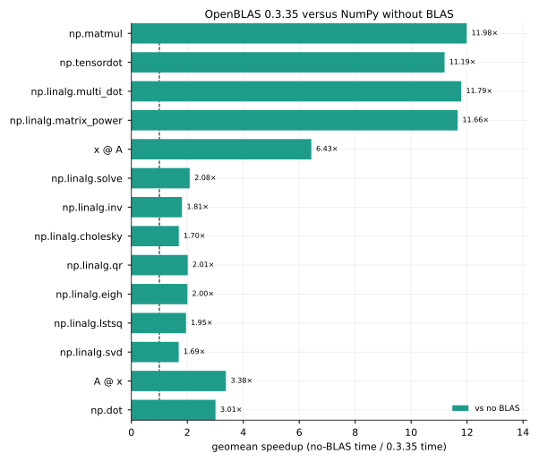
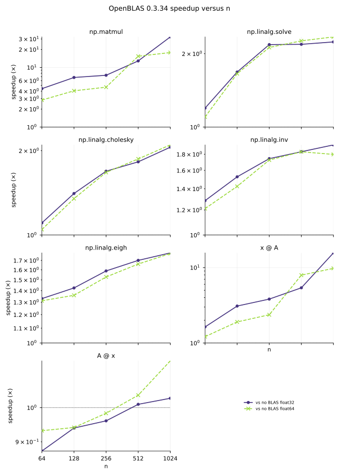
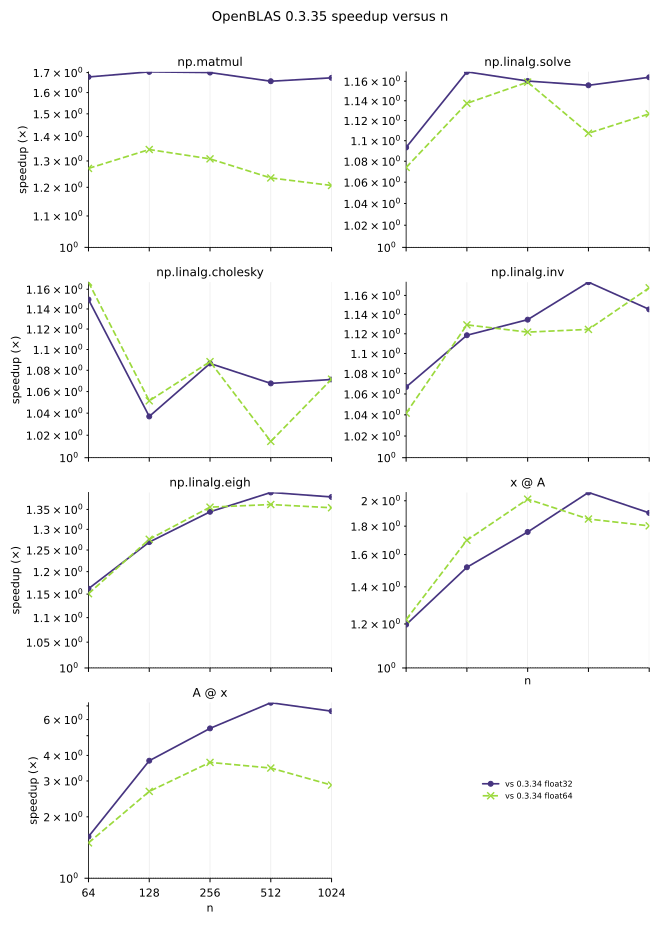

# The last mile of a long road: faster NumPy in the browser

For a long time, running NumPy in the browser meant running it without an accelerated BLAS. Matrix multiplications fell back to plain loops (portable, but blind to cache and SIMD).

That just changed. The [Emscripten-forge](https://emscripten-forge.org/) NumPy package now links [OpenBLAS](https://www.openblas.net/) in WebAssembly, and at `n = 1024` square `np.matmul` jumps to about **32.54×** faster (`float32`) and **17.78×** faster (`float64`). The next OpenBLAS release, already available as an experimental package on Emscripten-forge, with kernels contributed by QuantStack, pushes it further.

## What is Emscripten-forge?

[Emscripten-forge](https://emscripten-forge.org/) is a software distribution for WebAssembly. Together with [conda-forge](https://conda-forge.org/), it rebuilds the conda ecosystem for WebAssembly, so compilers, runtimes, and shared libraries ship as redistributable **conda packages** with a coherent ABI (not Python wheels, not R packages, but native libraries that any language ecosystem can link).

Bringing a scientific language to the browser is hard enough that, so far, it has mostly happened one language at a time. [Pyodide](https://pyodide.org/) pioneered it for Python. Later on, [WebR](https://docs.r-wasm.org/webr/latest/) did it for R, on the same premise. Each is a self-contained, language-specific distribution. Emscripten-forge takes a different shape: a language-agnostic distribution. It builds on the foundational work of the Pyodide and WebR projects, and goes further, covering not only Python and R, but also C++, OCaml, Lua, compiler toolchains, and many more tools (and shipping with a package manager).

## The missing compiler: Fortran on wasm32

Fortran sits at the core of foundational scientific packages: [LAPACK](https://www.netlib.org/lapack/), historically much of [SciPy](https://scipy.org/) (although this is changing as SciPy has made strides to become Fortran-free), and R's compiled statistical routines are all Fortran underneath. Bringing any of them to WebAssembly therefore means bringing a Fortran compiler that can target `wasm32`.

For a while, Pyodide worked around the absence of such a compiler: its SciPy build was produced with [f2c](https://www.netlib.org/f2c/), a Fortran-to-C translator, so the Fortran source was transpiled to C and compiled with the existing Emscripten toolchain. That workaround got SciPy into the browser, but it was not enough for R, whose distribution could not sidestep a real Fortran compiler. That constraint is what started the work on [Flang](https://flang.llvm.org/) (LLVM's Fortran frontend) for WebAssembly, in the context of bringing [R to the browser on Emscripten-forge](https://medium.com/jupyter-blog/r-in-the-browser-announcing-our-webassembly-distribution-9450e9539ed5).

## OpenBLAS in WebAssembly

Building a Fortran toolchain for WebAssembly was itself a multi-person effort. [Thorsten Beier](https://github.com/DerThorsten), [Isabel Paredes](https://github.com/IsabelParedes), [Anutosh Bhat](https://github.com/anutosh491), and [Serge Guelton](https://github.com/serge-sans-paille) wrote the initial Flang patches for WebAssembly; [Serge Guelton](https://github.com/serge-sans-paille) upstreamed parts of that work into LLVM; and [Axel Obermeier](https://github.com/h-vetinari) helped land the patches in the [conda-forge flang feedstock](https://github.com/conda-forge/flang-feedstock), so the toolchain installs like any other conda package. Emscripten-forge now maintains its own recipe, [`flang_emscripten-wasm32`](https://github.com/emscripten-forge/recipes/tree/main/recipes/recipes/flang_emscripten-wasm32).

But even with a working Flang, the toolchain alone was not enough to bring OpenBLAS to the browser. The first OpenBLAS and LAPACK builds could not be used immediately: WebAssembly enforces stricter calling conventions than native targets, and additional patches were needed to make the library compile, archive, and link under Emscripten. [Ian Thomas](https://github.com/ianthomas23) adapted OpenBLAS for Flang and Emscripten; those patches live in the [Emscripten-forge OpenBLAS recipe](https://github.com/emscripten-forge/recipes/tree/main/recipes/recipes_emscripten/openblas) (the bridge between upstream OpenBLAS and the NumPy builds measured in this post).

The rest of this post walks the last mile: what changed when NumPy could finally call a BLAS, and what OpenBLAS 0.3.34 and the upcoming 0.3.35 deliver.

## The last mile: NumPy links OpenBLAS

NumPy calls BLAS and LAPACK for matrix products and factorizations; which implementation is linked is what changed on this last mile.

The previous [Emscripten-forge](https://emscripten-forge.org/) NumPy package (`2.5.2` on [emscripten-forge-4x](https://prefix.dev/channels/emscripten-forge-4x/packages/numpy)) was built without OpenBLAS. Without OpenBLAS, NumPy still provides `np.matmul`, `@`, and `np.linalg`, but it uses its own C implementations: portable loops rather than kernels written for a given SIMD instruction set or cache hierarchy. Matrix products then spend most of their time on memory traffic rather than arithmetic. That is the **no BLAS** column in the tables below.

Since [emscripten-forge/recipes#6310](https://github.com/emscripten-forge/recipes/pull/6310), the default NumPy package on [emscripten-forge-4x](https://prefix.dev/channels/emscripten-forge-4x/packages/numpy) (`2.5.3`, build 3) links OpenBLAS **0.3.34** with WASM SIMD (`TARGET=WASM128_GENERIC`). That build is no longer experimental: it comes from the main channel. Calls such as `np.matmul`, `@`, and `np.linalg.solve` dispatch to that BLAS in WebAssembly rather than the bundled fallback.

On Emscripten-forge, OpenBLAS is a **separate conda package**. NumPy links `libopenblas` at runtime, so a newer OpenBLAS can be installed without rebuilding the NumPy conda package. The same shared library benefits other consumers that link BLAS or LAPACK: Scientific Python projects such as SciPy and scikit-learn, and stacks outside that ecosystem as well (for example [xtensor-blas](https://github.com/xtensor-stack/xtensor-blas)). Typical PyPI NumPy wheels instead **vendor** a BLAS snapshot at build time: they cannot pick up a newer OpenBLAS automatically, and a new NumPy wheel must be built and redistributed with that version vendored. The same main-channel NumPy 2.5.3 package can therefore use OpenBLAS **0.3.35** once that OpenBLAS package is published (another short stretch after the first link-up).

## Benchmarks Settings

WebAssembly numbers are median-time speedups. Tables also give median time and GFLOPS. The **linux-64** column (appendices) is the same API grid on this machine.

| Setting | Value |
| --- | --- |
| Host | Dell XPS 15 9530, 13th Gen Intel Core i7-13700H (6P+8E, 20 threads, AVX2, up to 5.0 GHz), 64 GB RAM, Fedora Linux 44 |
| WebAssembly | Chromium 153; OpenBLAS `USE_THREAD=0 TARGET=WASM128_GENERIC` |
| linux-64 | [conda-forge](https://conda-forge.org/) `linux-64` NumPy 2.5.2 and OpenBLAS 0.3.34 (`DYNAMIC_ARCH`, Haswell kernel), one thread (`OPENBLAS_NUM_THREADS=1`), pinned to a P-core |
| Matrix sizes | 64, 128, 256, 512, 1024 |
| Vector sizes | 10⁴, 10⁵, 10⁶ |
| dtypes | `float32`, `float64` |
| Statistic | median of 10 samples after 5 warmups |
| Scripts | [github.com/jjerphan/numpy-wasm-openblas-bench](https://github.com/jjerphan/numpy-wasm-openblas-bench) (private for now) |

## OpenBLAS 0.3.34 versus no BLAS

Relative to the same Emscripten-forge stack without a BLAS, square `np.matmul` at `n = 1024` reaches about **32.54×** (`float32`) and **17.78×** (`float64`) (28.0 / 14.6 GFLOPS versus 0.86 / 0.82 GFLOPS). Full size grids and a single-thread linux-64 reference are in [Appendix A](#appendix-a-full-results).



Geometric mean over both dtypes and the size grid (OpenBLAS 0.3.34 time in the denominator). Matrix products benefit most. `np.linalg` is 1.21–1.84× faster than no BLAS. `A @ x` and vector `np.dot` remain near 1×: OpenBLAS 0.3.34 does not provide a fast column-major GEMV for that layout. OpenBLAS 0.3.35 adds that kernel.

Without a BLAS, `np.matmul` throughput decreases with `n` (naive GEMM, cache misses). With OpenBLAS 0.3.34 it increases with `n`. Operations implemented on top of GEMM (`@`, two-dimensional `np.dot`, `np.tensordot`, `np.linalg.multi_dot`) follow the same trend. Speedup versus `n` is plotted in [Appendix C](#appendix-c-advanced-graphs).

On `np.linalg` at `n = 1024` (`float32`), median times drop by about **1.3–2.3×** versus no BLAS (`solve` 2.24×, `cholesky` 2.06×, `qr` 2.27×, `inv` 1.93×, `eigh` 1.78×, `svd` 1.33×; `float64` agrees to within a few percent). For matrix–vector products, `x @ A` already uses a Level-2 kernel in 0.3.34 (**15.66×** at `float32`, `n = 1024`), while `A @ x` stays near the no-BLAS ~4 GFLOPS (**1.03×**).

## OpenBLAS 0.3.35 will be even faster

The next OpenBLAS release includes WASM SIMD work already on `develop`. The numbers below use the local Emscripten-forge snapshot from [emscripten-forge/recipes#6704](https://github.com/emscripten-forge/recipes/pull/6704) (`0.3.35.dev0`, `develop` @ `b4100af`, build 2), still `TARGET=WASM128_GENERIC`. That refresh is 22 commits past the earlier [#6611](https://github.com/emscripten-forge/recipes/pull/6611) snapshot (`803f36bc`).

QuantStack contributed the kernels. [Julien Jerphanion](https://github.com/jjerphan):

- [#5983](https://github.com/OpenMathLib/OpenBLAS/pull/5983) 4×4 SGEMM / DGEMM
- [#5984](https://github.com/OpenMathLib/OpenBLAS/pull/5984) SAXPY / DAXPY
- [#5985](https://github.com/OpenMathLib/OpenBLAS/pull/5985) 2×2 CGEMM
- [#5986](https://github.com/OpenMathLib/OpenBLAS/pull/5986) 4×4 DTRMM
- [#5990](https://github.com/OpenMathLib/OpenBLAS/pull/5990) SGEMV / DGEMV
- [#6020](https://github.com/OpenMathLib/OpenBLAS/pull/6020) relaxed SIMD opt-in (portable SIMD128 default)
- [#6023](https://github.com/OpenMathLib/OpenBLAS/pull/6023) WASM SIMD128 8×4 SGEMM (DGEMM stays 4×4)
- [#6024](https://github.com/OpenMathLib/OpenBLAS/pull/6024) Node/Emscripten numerical CBLAS test suite

[Matthias Meschede](https://github.com/MMesch):

- [#5996](https://github.com/OpenMathLib/OpenBLAS/pull/5996) `ifndef` KERNEL guards so the WASM128 overrides survive
- [#6001](https://github.com/OpenMathLib/OpenBLAS/pull/6001) [relaxed-simd](https://github.com/WebAssembly/relaxed-simd) `v_muladd` when the opcode exists

[Martin Kroeker](https://github.com/martin-frbg):

- [#6022](https://github.com/OpenMathLib/OpenBLAS/pull/6022) f2c LAPACK warning fixes (in the same `develop` range)

[#6020](https://github.com/OpenMathLib/OpenBLAS/pull/6020) leaves WebAssembly relaxed-SIMD FMA disabled in the generic default binary measured here; the portable SIMD128 path is what ships. The headline `float32` GEMM step from 0.3.34 is the 8×4 microkernel in [#6023](https://github.com/OpenMathLib/OpenBLAS/pull/6023).

Versus WASM OpenBLAS 0.3.34 at `n = 1024`, `np.matmul` improves by **1.67×** (`float32`, 28.0 → 46.8 GFLOPS) and **1.21×** (`float64`, 14.6 → 17.6 GFLOPS). Full grids and linux-64 fractions are in [Appendix B](#appendix-b-openblas-0335-versus-0334).



Geometric mean over both dtypes and the size grid (OpenBLAS 0.3.35 time in the denominator). The largest relative gains versus WASM 0.3.34 are not only in GEMM: **`A @ x`** jumps from the no-BLAS ~4 GFLOPS to **27.6 GFLOPS** (`float32`, `n = 1024`) via the GEMV kernels (**6.59×** versus 0.3.34; `x @ A` is **1.90×**). Vector `np.dot` improves similarly. Square `np.matmul` is **1.46×** in geometric mean (and **1.67×** at `n = 1024` `float32` from the 8×4 SGEMM). On `np.linalg` at `n = 1024` `float32`, median times improve by about **1.1–1.5×** versus 0.3.34 (`solve` 1.16×, `cholesky` 1.07×, `qr` 1.24×, `inv` 1.15×, `eigh` 1.38×, `svd` 1.51×).

### From no BLAS to OpenBLAS 0.3.35

Putting both steps together (linking OpenBLAS, then picking up the 0.3.35 kernels) is the speedup users should eventually see when moving from the previous no-BLAS Emscripten-forge NumPy to NumPy + OpenBLAS **0.3.35**.



Geometric mean over both dtypes and the size grid (OpenBLAS 0.3.35 time in the denominator). Matrix products gain the most; Level-2 `A @ x` and vector `np.dot` finally move with the GEMV kernels that 0.3.34 lacked; `np.linalg` sits in a smaller but still clear band above 1×. Today's main-channel NumPy already delivers the OpenBLAS 0.3.34 half of that path; 0.3.35 is the remaining stretch once that OpenBLAS package lands on the channel users install from.

## Using the packages

NumPy linked against OpenBLAS is on the main [`emscripten-forge-4x`](https://prefix.dev/channels/emscripten-forge-4x) channel (as of [emscripten-forge/recipes#6310](https://github.com/emscripten-forge/recipes/pull/6310)). No experimental channel is required for that combination: install `numpy` and it pulls in OpenBLAS **0.3.34**.

As an example, an environment for [JupyterLite](https://jupyterlite.readthedocs.io/) or [notebook.link](https://notebook.link):

```yaml
name: numpy-openblas
channels:
  - https://prefix.dev/emscripten-forge-4x
  - https://prefix.dev/conda-forge
dependencies:
  - xeus-python
  - numpy
```

OpenBLAS **0.3.35** (`0.3.35.dev0`) remains on [`emscripten-forge-4x-experimental`](https://prefix.dev/channels/emscripten-forge-4x-experimental); the measurements above use that build (`develop` @ `b4100af` from [emscripten-forge/recipes#6704](https://github.com/emscripten-forge/recipes/pull/6704)). Add the experimental channel only when you want the newer OpenBLAS without rebuilding NumPy:

```yaml
name: numpy-openblas-035
channels:
  - https://prefix.dev/emscripten-forge-4x
  - https://prefix.dev/emscripten-forge-4x-experimental
  - https://prefix.dev/conda-forge
dependencies:
  - xeus-python
  - numpy
  - openblas=0.3.35*
```

The [#6704](https://github.com/emscripten-forge/recipes/pull/6704) / [#6020](https://github.com/OpenMathLib/OpenBLAS/pull/6020) portable default measured here does **not** require [WebAssembly relaxed SIMD](https://github.com/WebAssembly/relaxed-simd). Optional builds that turn FMA on do: Chrome ≥114 and Firefox ≥146 work; Safari needs the JavaScriptCore flag `useWebAssemblyRelaxedSIMD` or the environment fails to load. Current engine support is tracked at [webassembly.org/features](https://webassembly.org/features/).

The packaging work described above also flows back where it is useful. Pyodide can adopt pieces from Emscripten-forge (for example an OpenBLAS build and a Fortran toolchain that targets WebAssembly) when that fits its distribution goals.

## Acknowledgements

Thanks to the people and communities who built the road this post only measures at the end:

- [Martin Kroeker](https://github.com/martin-frbg) and the [OpenMathLib / OpenBLAS](https://github.com/OpenMathLib/OpenBLAS) contributors, for maintaining a portable high-performance BLAS and LAPACK across architectures.
- [Thorsten Beier](https://github.com/DerThorsten), [Isabel Paredes](https://github.com/IsabelParedes), [Anutosh Bhat](https://github.com/anutosh491), and [Serge Guelton](https://github.com/serge-sans-paille), for the Flang patches that made Fortran-on-`wasm32` practical; [Serge Guelton](https://github.com/serge-sans-paille) for upstreaming parts of that work into LLVM; and [Axel Obermeier](https://github.com/h-vetinari) for helping land the toolchain in the [conda-forge flang feedstock](https://github.com/conda-forge/flang-feedstock).
- [Ian Thomas](https://github.com/ianthomas23), for the OpenBLAS Flang and Emscripten patches in the [Emscripten-forge OpenBLAS recipe](https://github.com/emscripten-forge/recipes/tree/main/recipes/recipes_emscripten/openblas).
- The [Pyodide](https://pyodide.org/), [Emscripten-forge](https://emscripten-forge.org/), and [conda-forge](https://conda-forge.org/) communities, for browser scientific Python and redistributable native packages with a shared ABI.
- [Matthias Meschede](https://github.com/MMesch), for the WASM128 kernel-guard and relaxed-SIMD OpenBLAS work cited above; and QuantStack colleagues who helped ship the NumPy and OpenBLAS conda packages measured here.
- [Sylvain Corlay](https://github.com/sylvaincorlay), [Isabel Paredes](https://github.com/IsabelParedes), and [Ian Thomas](https://github.com/ianthomas23), for comments that improved this post.

---

## Appendix A: Full results

Absolute throughput and speedups for OpenBLAS **0.3.34** versus NumPy without BLAS, plus a single-thread conda-forge **linux-64** OpenBLAS 0.3.34 reference on the same machine. Speedup is baseline time divided by featured time (`>1` means the featured stack is faster).

### Geometric-mean speedups by API

| API | 0.3.34 vs no BLAS | 0.3.34 vs linux-64 | 0.3.35 vs 0.3.34 | 0.3.35 vs linux-64 |
| --- | ---: | ---: | ---: | ---: |
| `np.matmul` | 8.19× | 0.25× | 1.46× | 0.36× |
| `np.tensordot` | 7.86× | 0.26× | 1.42× | 0.37× |
| `np.linalg.multi_dot` | 8.11× | 0.25× | 1.45× | 0.36× |
| `np.linalg.matrix_power` | 7.96× | 0.25× | 1.47× | 0.36× |
| `x @ A` | 3.84× | 0.38× | 1.68× | 0.64× |
| `np.linalg.solve` | 1.84× | 0.45× | 1.13× | 0.51× |
| `np.linalg.inv` | 1.61× | 0.42× | 1.12× | 0.47× |
| `np.linalg.cholesky` | 1.57× | 0.46× | 1.08× | 0.50× |
| `np.linalg.qr` | 1.48× | 0.39× | 1.36× | 0.53× |
| `np.linalg.eigh` | 1.54× | 0.43× | 1.30× | 0.55× |
| `np.linalg.lstsq` | 1.38× | 0.47× | 1.41× | 0.66× |
| `np.linalg.svd` | 1.21× | 0.46× | 1.40× | 0.65× |
| `A @ x` | 0.98× | 0.18× | 3.44× | 0.62× |
| `np.dot` | 0.91× | 0.26× | 3.30× | 0.85× |

### `np.matmul` across sizes (GFLOPS)

| n | dtype | no BLAS | OpenBLAS 0.3.34 | OpenBLAS 0.3.35 | linux-64 | 0.3.34 vs no BLAS | 0.3.35 vs 0.3.34 | 0.3.34 vs linux-64 | 0.3.35 vs linux-64 |
| ---: | --- | ---: | ---: | ---: | ---: | ---: | ---: | ---: | ---: |
| 64 | `float32` | 4.89 | **21.5** | **36.1** | 84.7 | 4.41× | 1.68× | 0.25× | 0.43× |
| 64 | `float64` | 4.52 | **12.8** | **16.3** | 44.1 | 2.84× | 1.27× | 0.29× | 0.37× |
| 128 | `float32` | 3.62 | **24.5** | **41.8** | 110.4 | 6.79× | 1.70× | 0.22× | 0.38× |
| 128 | `float64` | 3.30 | **13.4** | **18.0** | 52.9 | 4.05× | 1.35× | 0.25× | 0.34× |
| 256 | `float32` | 3.50 | **25.9** | **44.0** | 120.5 | 7.39× | 1.70× | 0.21× | 0.37× |
| 256 | `float64` | 3.06 | **14.3** | **18.7** | 55.5 | 4.66× | 1.31× | 0.26× | 0.34× |
| 512 | `float32` | 2.14 | **27.5** | **45.6** | 118.6 | 12.87× | 1.66× | 0.23× | 0.38× |
| 512 | `float64` | 0.94 | **14.5** | **17.9** | 56.8 | 15.42× | 1.23× | 0.26× | 0.32× |
| 1024 | `float32` | 0.86 | **28.0** | **46.8** | 120.4 | 32.54× | 1.67× | 0.23× | 0.39× |
| 1024 | `float64` | 0.82 | **14.6** | **17.6** | 57.2 | 17.78× | 1.21× | 0.25× | 0.31× |

### `np.linalg` at `n = 1024` (median time, ms)

| call | dtype | no BLAS | OpenBLAS 0.3.34 | OpenBLAS 0.3.35 | linux-64 | 0.3.34 vs no BLAS | 0.3.35 vs 0.3.34 | 0.3.34 vs linux-64 | 0.3.35 vs linux-64 |
| --- | --- | ---: | ---: | ---: | ---: | ---: | ---: | ---: | ---: |
| `np.linalg.solve` | `float32` | 129 | **58** | **50** | 21 | 2.24× | 1.16× | 0.36× | 0.41× |
| `np.linalg.solve` | `float64` | 132 | **56** | **50** | 21 | 2.34× | 1.13× | 0.37× | 0.42× |
| `np.linalg.cholesky` | `float32` | 74 | **36** | **34** | 16 | 2.06× | 1.07× | 0.46× | 0.49× |
| `np.linalg.cholesky` | `float64` | 75 | **36** | **34** | 17 | 2.10× | 1.07× | 0.47× | 0.50× |
| `np.linalg.qr` | `float32` | 617 | **272** | **220** | 96 | 2.27× | 1.24× | 0.35× | 0.44× |
| `np.linalg.qr` | `float64` | 589 | **259** | **222** | 96 | 2.27× | 1.16× | 0.37× | 0.43× |
| `np.linalg.inv` | `float32` | 414 | **215** | **188** | 70 | 1.93× | 1.15× | 0.33× | 0.38× |
| `np.linalg.inv` | `float64` | 397 | **221** | **189** | 72 | 1.80× | 1.17× | 0.33× | 0.38× |
| `np.linalg.eigh` | `float32` | 887 | **497** | **360** | 171 | 1.78× | 1.38× | 0.34× | 0.48× |
| `np.linalg.eigh` | `float64` | 872 | **491** | **363** | 165 | 1.78× | 1.35× | 0.34× | 0.46× |
| `np.linalg.svd` | `float32` | 625 | **471** | **312** | 205 | 1.33× | 1.51× | 0.44× | 0.66× |
| `np.linalg.svd` | `float64` | 593 | **487** | **320** | 215 | 1.22× | 1.52× | 0.44× | 0.67× |

## Appendix B: OpenBLAS 0.3.35 versus 0.3.34

Matrix–vector `@` across the size grid (GFLOPS). The headline change in 0.3.35 is column-major `A @ x`.

| call | n | dtype | no BLAS | OpenBLAS 0.3.34 | OpenBLAS 0.3.35 | linux-64 | 0.3.34 vs no BLAS | 0.3.35 vs 0.3.34 | 0.3.34 vs linux-64 | 0.3.35 vs linux-64 |
| --- | ---: | --- | ---: | ---: | ---: | ---: | ---: | ---: | ---: | ---: |
| `x @ A` | 64 | `float32` | 3.03 | 4.94 | **5.91** | 12.0 | 1.63× | 1.20× | 0.41× | 0.49× |
| `x @ A` | 64 | `float64` | 3.06 | 3.72 | **4.54** | 9.57 | 1.21× | 1.22× | 0.39× | 0.47× |
| `x @ A` | 128 | `float32` | 3.17 | 9.81 | **14.9** | 27.5 | 3.09× | 1.52× | 0.36× | 0.54× |
| `x @ A` | 128 | `float64` | 3.07 | 5.85 | **9.94** | 18.6 | 1.90× | 1.70× | 0.31× | 0.53× |
| `x @ A` | 256 | `float32` | 3.46 | 13.2 | **23.2** | 42.0 | 3.82× | 1.76× | 0.31× | 0.55× |
| `x @ A` | 256 | `float64` | 3.01 | 7.13 | **14.4** | 25.1 | 2.37× | 2.01× | 0.28× | 0.57× |
| `x @ A` | 512 | `float32` | 2.55 | 13.8 | **28.5** | 43.2 | 5.40× | 2.07× | 0.32× | 0.66× |
| `x @ A` | 512 | `float64` | 0.93 | 7.35 | **13.6** | 14.1 | 7.94× | 1.85× | 0.52× | 0.96× |
| `x @ A` | 1024 | `float32` | 0.90 | 14.2 | **26.9** | 30.2 | 15.66× | 1.90× | 0.47× | 0.89× |
| `x @ A` | 1024 | `float64` | 0.77 | 7.50 | **13.5** | 14.3 | 9.77× | 1.80× | 0.53× | 0.95× |
| `A @ x` | 64 | `float32` | 2.93 | 2.56 | **4.10** | 10.7 | 0.88× | 1.60× | 0.24× | 0.38× |
| `A @ x` | 64 | `float64` | 2.92 | 2.72 | **4.06** | 9.79 | 0.93× | 1.49× | 0.28× | 0.41× |
| `A @ x` | 128 | `float32` | 4.19 | 3.94 | **14.8** | 24.2 | 0.94× | 3.77× | 0.16× | 0.61× |
| `A @ x` | 128 | `float64` | 4.10 | 3.85 | **10.3** | 19.9 | 0.94× | 2.67× | 0.19× | 0.52× |
| `A @ x` | 256 | `float32` | 4.40 | 4.22 | **22.9** | 38.5 | 0.96× | 5.43× | 0.11× | 0.60× |
| `A @ x` | 256 | `float64` | 4.27 | 4.20 | **15.5** | 28.6 | 0.98× | 3.70× | 0.15× | 0.54× |
| `A @ x` | 512 | `float32` | 4.21 | 4.26 | **30.9** | 42.6 | 1.01× | 7.25× | 0.10× | 0.73× |
| `A @ x` | 512 | `float64` | 4.12 | 4.28 | **14.9** | 15.2 | 1.04× | 3.47× | 0.28× | 0.98× |
| `A @ x` | 1024 | `float32` | 4.06 | 4.18 | **27.6** | 29.5 | 1.03× | 6.59× | 0.14× | 0.93× |
| `A @ x` | 1024 | `float64` | 3.68 | 4.25 | **12.2** | 14.9 | 1.15× | 2.86× | 0.28× | 0.81× |

## Appendix C: Advanced graphs

Speedup versus matrix size for the NumPy APIs that dominate typical workloads (`np.matmul`, `np.linalg.solve` / `cholesky` / `inv` / `eigh`, and both `@` layouts). The ratio is baseline time divided by featured OpenBLAS time; values above 1 mean the featured stack is faster. `float32` is solid with points; `float64` is dashed with ×. linux-64 comparisons stay in the tables; the plots show only the WebAssembly baselines.

### OpenBLAS 0.3.34 versus no BLAS



`np.matmul` and `x @ A` increase with `n` versus no BLAS; `A @ x` does not.

### OpenBLAS 0.3.35 versus 0.3.34



`A @ x` is the clearest step from 0.3.34 to 0.3.35.
